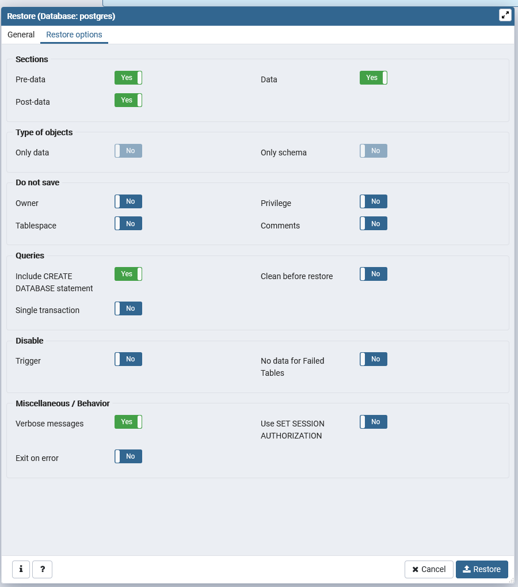

# Eventdoo Service
Eventdoo is a platform that helps you organise your events by providing a plattform to offer and order services.
Every user can both provide and order services on our marketplace.

This hybrid application was developed as a group project as part of the lecture Introduction to Software Engineering in the Bachelor's program of Computer Science at the university of Bern.

## Prerequisites
To get started you need to install Node.js and NPM on your machine.
You can download the latest version right here https://nodejs.org/en/. NPM is automatically installed with the latest version of Node.js.
You can verify the installation by running `node -v` and `npm -v` in your desired Terminal.

#### General Setup
Then you need to install [Angular CLI](https://cli.angular.io/), [Ionic](https://ionicframework.com/) and [Express](https://expressjs.com/de/) by running the following commands in your Terminal of choice. (Powershell, cmd etc.).

- `npm install -g @angular/cli`
- `npm install -g ionic`
- `npm install -g express`

The Angular and the Ionic framwork were used in the frontend part of this project to develop an application that runs on your PC as well as your mobile device.
The Express framework is used for the backend part.

#### Database

The database we use is an PostgreSQL database. Until January 2020 this database is hosted on Google Cloud services. Aftwerwards we will take it down from there to avoid costs.

Since this is a service from Google and we don't have any control over the server we do not guarantee that it will work all the time.

If the Google database doesn't work or it is after January 2020 then you will have to refer to `How to install the database locally`.

## Run the application

Now you can clone our [git-repository](https://github.com/scg-unibe-ch/ese2019-team5).

Once you did this you you can start the application by executing the following steps in your Terminal:

- `cd` in to the backend folder.
- Run `npm install`. This will install all de dependencies you need for the app to work correctly.
- Then compile the app with `npm run tsc` which will create a build folder with the typescript files compiled to javascript files.
- Aufter this enter run `node build/server.js`. This will start the backend part of the application. If it was sucessful it should say something similar to `Listening at http://localhost:3000/`

Now the backend is running. Following the steps to get the frontend started as well. It is important that you run them in an diffrent instance of your terminal:

- `cd` in to the frontend folder.
- Run `npm install` which again will install the required dependencies.
- Run `ionic serve` to open the applicaiton in your default web browser on `http://localhost:8100/`.
- If you desire an dev server you can run `ng serve` this will open the app in your web browser on `http://localhost:4200/` and automatically reload after every change made to the frontend project.

  

## How to install the database locally

#### Install PostgreSQL

- Fist of all you need to download and install PostgreSQL 11 from `https://www.postgresql.org/download/windows/`.
(We used version 11, it may also work with version 12 but we didn't verify this and do not guarantee it.)
    - Make sure to select `pgAdmin 4`, `PostgreSQL server`, `Command Line Tools` when you're asked to select components.
    - When you're asked to set a password enter `root`(If you choose an other password you'll have to change this in the code: `backend/app/services/db.services.ts` line 40)
    - Leave the port on `5432`

#### Import our database

- Once you installed PostgreSQL open pgAdmin 4
- Right Click on the existing postgres database and select Restore.
    - Leave the Format on `Custom or tar`
    - Filename: navigate to the `eventdoo_db` file in the `/DB_dump/`folder.
    - Number of jobs: leve this emtpy.
    - Role name: choose postgres
    - Change to the Restore options tab and select the as in the picture below:
    
    - Hit the `Restore` button

As soon as this taks completed sucessfully you can rightclick `Refresh` on Databases and the `eventdoo` database should appear.

Now that you've setup your local database server you need to modify our app that it uses the local one and not the Google database.

#### Change between local and Google database

To change to the local database you'll need to edit the `getClient` method in the file  [`db.services.ts`](./backend/app/services/db.services.ts).

You have to uncomment line `37 to 43` and declare line `47 to 53` as comment.

## Project structure
This project contains tow important folders - the backend and the frontend folder - both these folders contain their own projects.

The backend contains the Express application that reacts to HTTP requests.

The frontend contains an Ionic application that sends HTTP requests to the backend.

## Technologies used

- Node.js
- Express
- Angular
- Ionic
- PostgreSQL

## License (vielleicht)

This Project isn't intended for further use. If you can use parts of it for your own project go ahead but we don't take responsiblity for any errors.